# 🧩 Microservices E-Commerce Platform

### 🐳 Node.js | 🐇 RabbitMQ | 🔐 JWT | 🚪 API Gateway | 🧱 MongoDB

---

## 🚀 Giới thiệu

Dự án minh họa cách xây dựng **hệ thống thương mại điện tử (E-commerce)** theo **kiến trúc Microservices**, trong đó các chức năng chính được tách thành các service độc lập:

- 👤 **Auth Service:** Quản lý người dùng, đăng ký/đăng nhập & JWT
- 🛍️ **Product Service:** Quản lý sản phẩm & tồn kho
- 🧾 **Order Service:** Quản lý đơn hàng & cập nhật tồn kho qua RabbitMQ
- 🚪 **API Gateway:** Cổng duy nhất nhận và định tuyến request

Hệ thống vận hành trên Docker, sử dụng RabbitMQ để giao tiếp bất đồng bộ giữa các service.

---

## ⚙️ 1. Cài đặt RabbitMQ trên Docker

Chạy lệnh sau để khởi tạo RabbitMQ:

```bash
docker run -it --rm --name rabbitmq -p 5672:5672 -p 15672:15672 rabbitmq:4-management
```

🔗 Truy cập: [http://localhost:15672](http://localhost:15672)
👤 Tài khoản: `guest` / `guest`

📸 **Giao diện quản lý RabbitMQ**
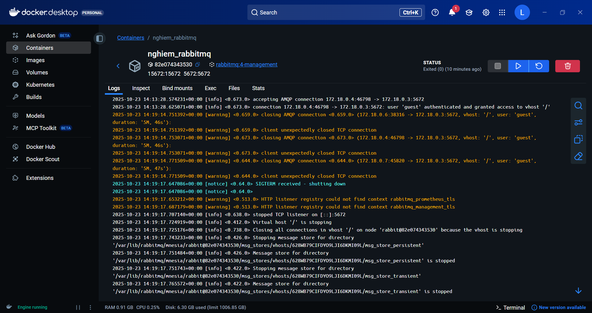

---

## 🧱 2. Khởi tạo các Container khác

📸
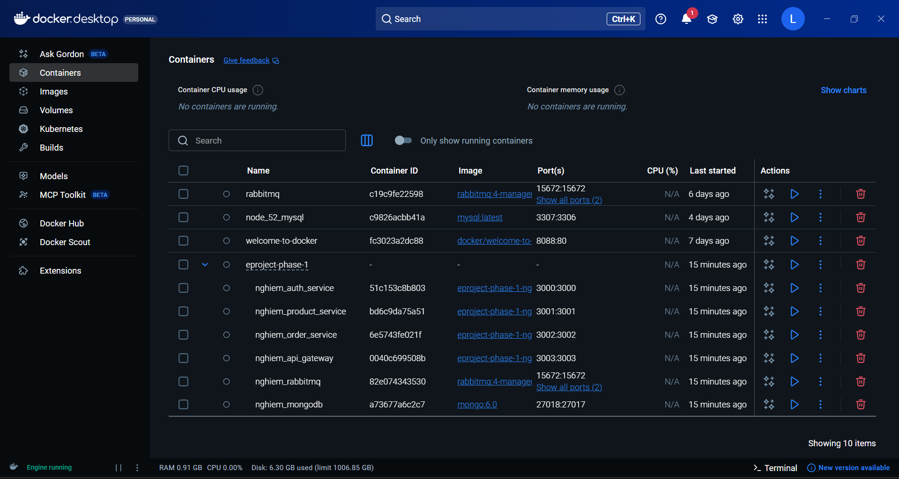

---

## 🌐 3. Cấu hình API Gateway

Cập nhật file cấu hình để định tuyến đến đúng các service (Auth, Product, Order).

📸
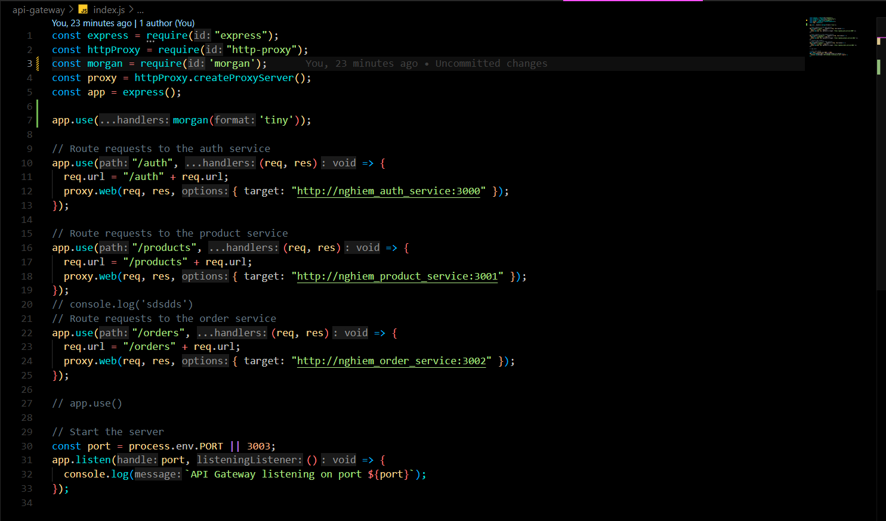

---

## 🔑 4. Tạo JWT khi đăng nhập

Thêm logic ký **JWT Token** trong Auth Service để xác thực người dùng.

📸
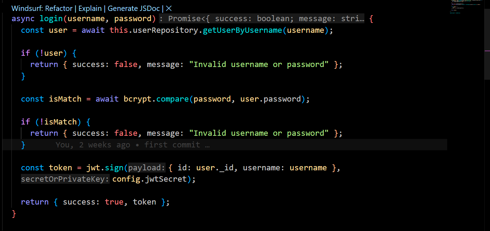

---

## 🧪 5. Kiểm thử API với Postman

### 🧍‍♂️ Đăng ký tài khoản

`POST /auth/api/v1/register`
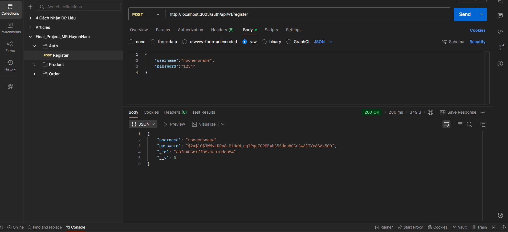
📦 **Kết quả trong MongoDB:**
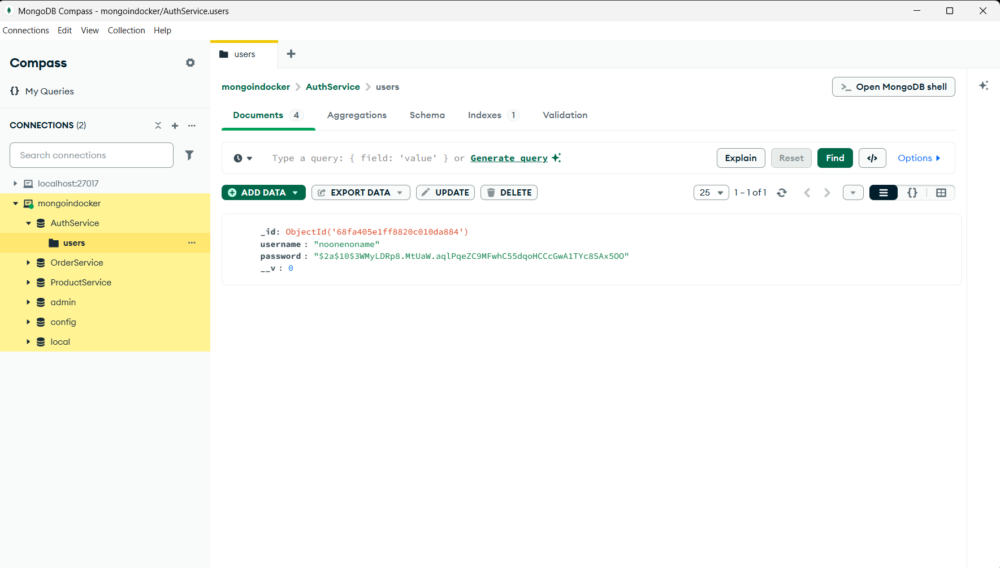

---

### 🔐 Đăng nhập tài khoản

`POST /auth/api/v1/login`
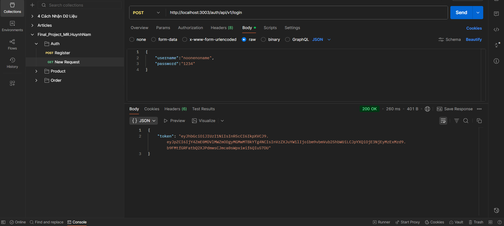
✅ Nhận **JWT Token**

---

### 🛒 Thêm sản phẩm

`POST /products/api/v1/products/add`
Truyền token vào header:

```
Authorization: Bearer <JWT_TOKEN>
```

📸
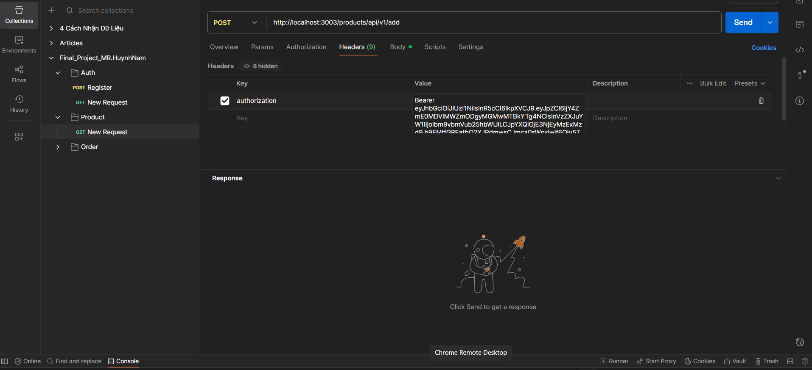
📦 **Kết quả trong MongoDB:**
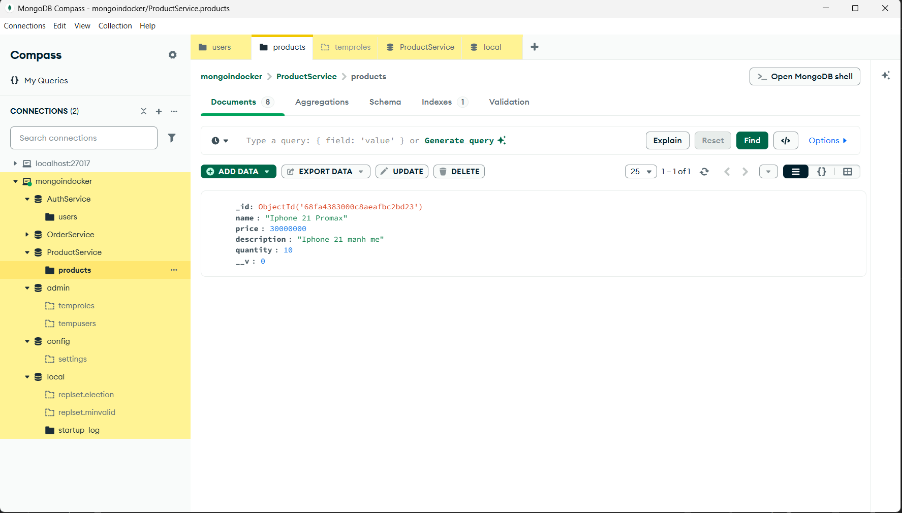

---

### 📦 Xem danh sách sản phẩm

`GET /products/api/v1/`
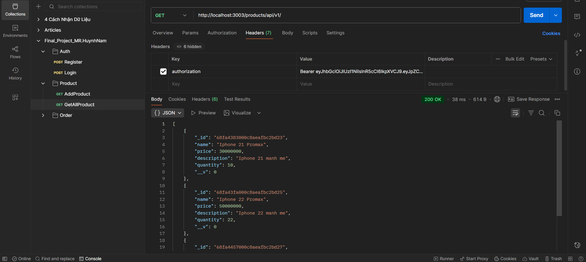

---

### 🧾 Tạo đơn hàng

`POST /products/api/v1/buy`
Truyền `ids` và `quantity` trong body.
📸
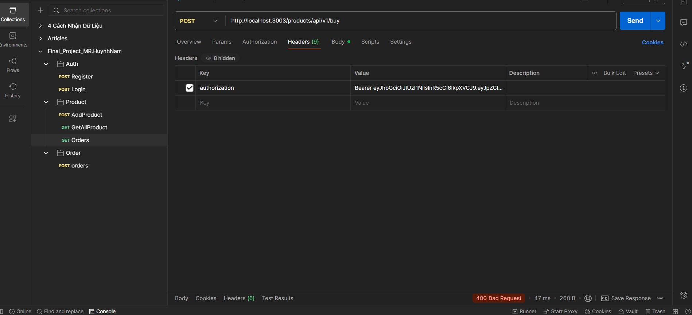

📦 Nếu **hết hàng:**
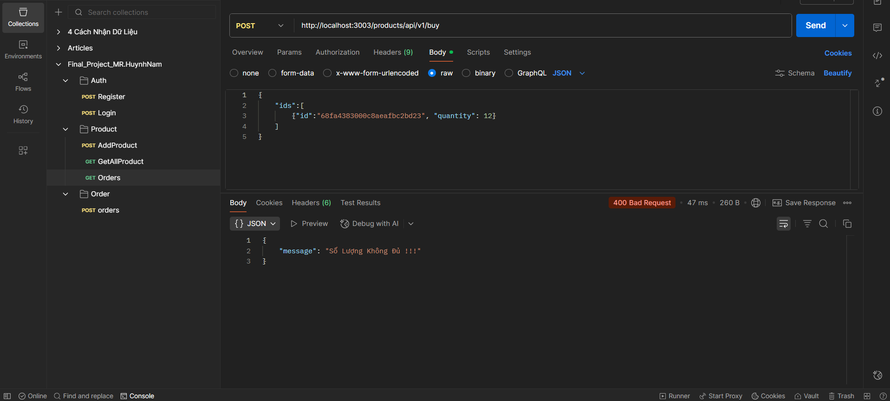

✅ Nếu **đặt hàng thành công:**
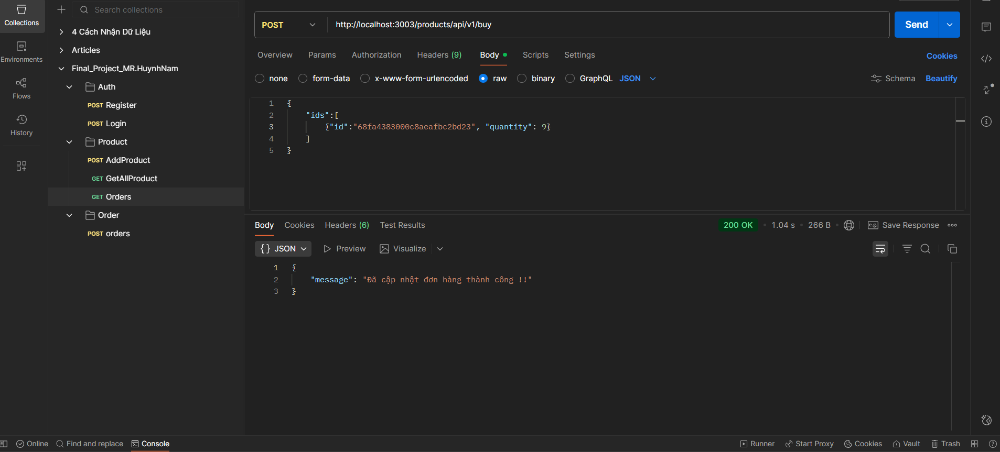

📊 Kiểm tra trong MongoDB:
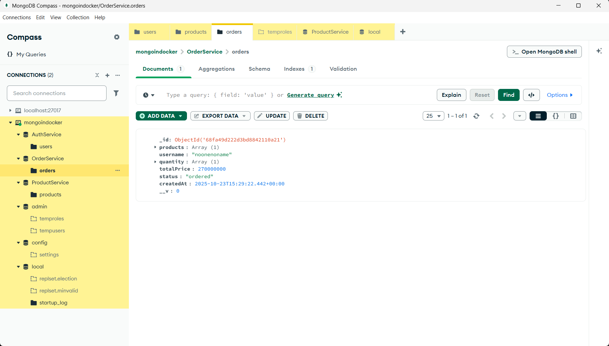

---

## 🔁 6. CI/CD với GitHub Actions

Tự động build & deploy dự án thông qua workflow GitHub Actions.
📸
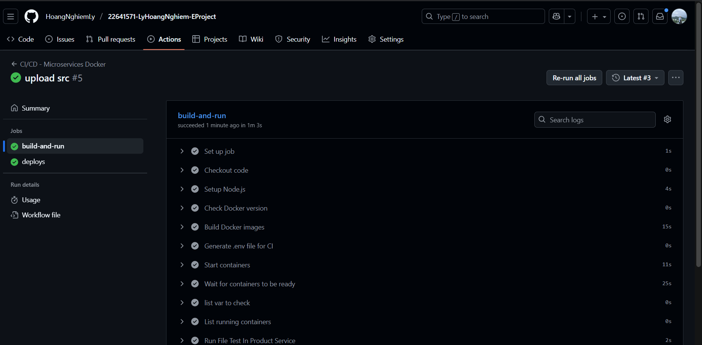

---

## 🧠 Tổng kết hệ thống

### 💡 1. Hệ thống giải quyết vấn đề gì?

Giải quyết bài toán **E-commerce**, với 3 module chính: **Auth**, **Product**, **Order**.

---

### 🧩 2. Gồm bao nhiêu dịch vụ?

Tổng cộng **6 dịch vụ**:

- **Ứng dụng:** `api_gateway`, `auth_service`, `product_service`, `order_service`
- **Hạ tầng:** `mongodb`, `rabbitmq`

---

### 🧰 3. Ý nghĩa từng dịch vụ

| Dịch vụ                     | Vai trò                               |
| --------------------------- | ------------------------------------- |
| 🗄️ `nghiem_mongodb`         | Lưu dữ liệu (User, Product, Order)    |
| 🐇 `nghiem_rabbitmq`        | Hàng đợi tin nhắn bất đồng bộ         |
| 🚪 `nghiem_api_gateway`     | Cổng định tuyến request               |
| 👤 `nghiem_auth_service`    | Xử lý đăng ký, đăng nhập, JWT         |
| 🛍️ `nghiem_product_service` | Quản lý sản phẩm & tồn kho            |
| 🧾 `nghiem_order_service`   | Xử lý đơn hàng & sự kiện qua RabbitMQ |

---

### 🧠 4. Mẫu thiết kế sử dụng

- 🧩 **Microservices Architecture**
- 🚪 **API Gateway Pattern**
- 🗃️ **Database per Service**
- 📬 **Event-Driven / Pub-Sub (RabbitMQ)**

---

### 🔄 5. Giao tiếp giữa các service

- **Đồng bộ (HTTP):** `Client → API Gateway → Service`
- **Bất đồng bộ (RabbitMQ):** `Order Service → RabbitMQ → Product Service`

---

## 🌟 Kết luận

✅ Hệ thống microservices hoạt động ổn định với giao tiếp đồng bộ & bất đồng bộ.
✅ RabbitMQ giúp tách biệt service, tăng khả năng mở rộng và chịu lỗi.
✅ API Gateway & JWT bảo mật luồng giao tiếp giữa client và backend.

---

> 💻 **Tác giả:** _Ly Hoang Nghiem_
> 🗓️ **Phiên bản:** 1.0
> 📦 **Chạy dự án:**
>
> ```bash
> docker-compose up
> ```

---
